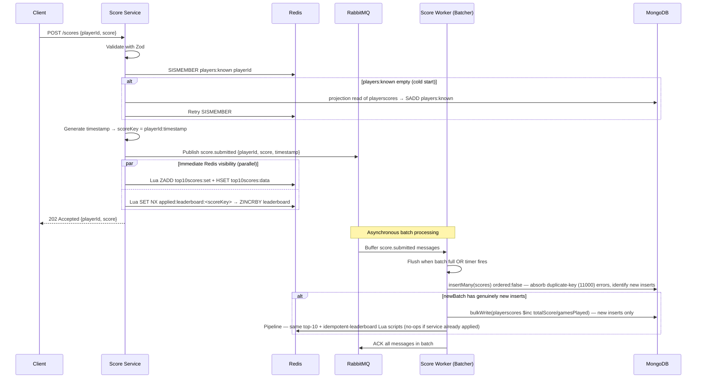
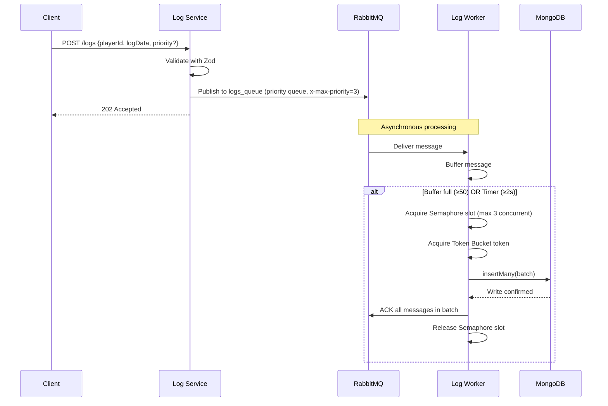
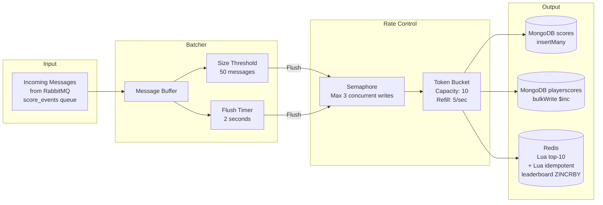
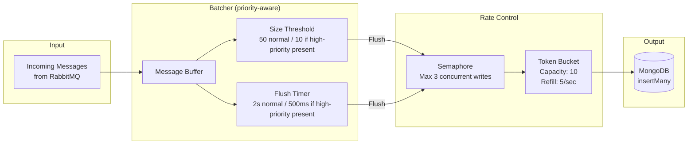
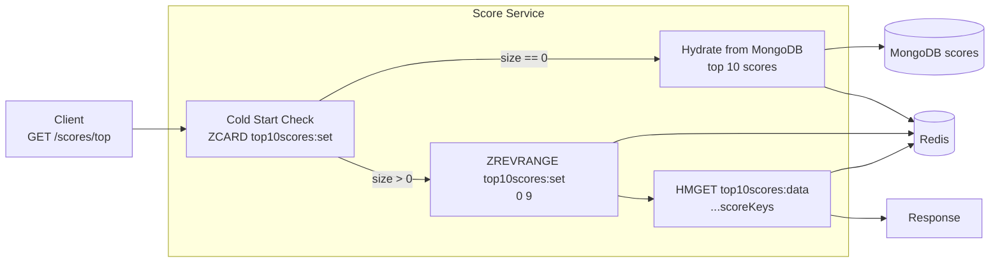
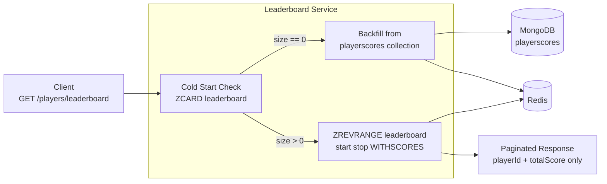
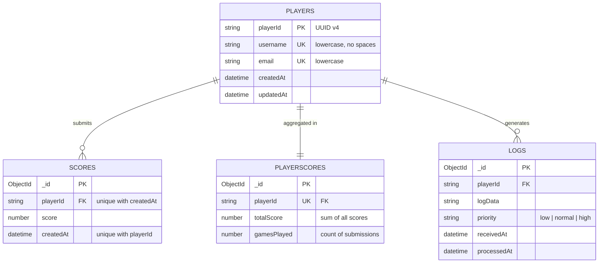
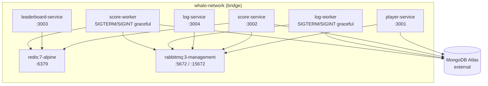

# Architecture

This document covers the runtime topology, the three async data flows (score, player events, log), the retry-safety model, and the Redis / MongoDB layout. The design principles driving it are:

- **Async, bounded write paths** — `/scores` and `/logs` return `202` immediately and persist via a RabbitMQ → batch-worker pipeline, so HTTP latency is decoupled from DB write throughput.
- **Redis is the source of truth for rankings** — the leaderboard sorted set and the top-10 set + hash are never TTL'd; MongoDB is the durable backup, not the read path.
- **Idempotent by construction** — every redelivery-safe step is enforced by a Mongo unique index, a scoped `$inc`, or an idempotent Lua script.
- **Eventually consistent fan-out** — `player.*` events propagate over RabbitMQ so score-service can update its denormalized state (`playerscores` aggregates, `players:known` existence set) without being on the player-service's HTTP critical path.
- **No cross-service denormalization of display names** — scores and playerscores store `playerId` only. Clients resolve usernames for leaderboard / top-score rows via `GET /players/:playerId` against `player-service` when enrichment is needed.

## System Overview

```mermaid
graph TB
    Client[Mobile Game Client]

    subgraph API["Microservices (Express.js / TypeScript)"]
        PS[Player Service<br/>:3001]
        SS[Score Service<br/>:3002]
        LS[Leaderboard Service<br/>:3003]
        LGS[Log Service<br/>:3004]
    end

    subgraph Queue["Message Broker"]
        RMQ[RabbitMQ<br/>:5672]
    end

    subgraph Workers["Background Workers"]
        LW[Log Worker]
        SW[Score Worker]
    end

    subgraph Storage["Data Layer"]
        MongoDB[(MongoDB Atlas)]
        Redis[(Redis<br/>:6379)]
    end

    Client -->|CRUD /players| PS
    Client -->|POST /scores<br/>GET /scores/top| SS
    Client -->|GET /players/leaderboard| LS
    Client -->|POST /logs| LGS

    PS -->|Read/Write players| MongoDB
    PS -->|Publish player_events| RMQ
    SS -->|Read (cold-start hydration of players:known + top-10)| MongoDB
    SS -->|SISMEMBER players:known| Redis
    SS -->|Publish score_events| RMQ
    SS -->|Consume player_events| RMQ
    LS -->|ZREVRANGE leaderboard| Redis
    LGS -->|Publish logs_queue| RMQ

    RMQ -->|Consume logs_queue| LW
    RMQ -->|Consume score_events| SW
    LW -->|Batch insertMany()| MongoDB
    SW -->|Update playerscores| MongoDB
    SW -->|Idempotent Lua<br/>leaderboard + top-10| Redis
    SS -.->|Idempotent Lua<br/>leaderboard + top-10<br/>(sync visibility)| Redis
```

---

## Score Pipeline — Async Data Flow



**Sync-visibility path.** Both Redis read paths are updated on the HTTP request so the client sees its submission reflected in `/scores/top` and `/players/leaderboard` before the worker ever touches the `score_events` queue. Without this, any queue backlog (e.g., under k6 load) would delay visible leaderboard totals by the full FIFO depth — users would submit a score and watch it apparently vanish until the worker caught up.

**Retry idempotency** is enforced at four independent layers, so the service's sync writes *and* the worker's async retry writes can execute against the same message without corruption:

- **MongoDB scores** — a unique compound index on `{ playerId, createdAt }` causes `insertMany({ordered:false})` to absorb duplicate-key (11000) errors silently on retry. The response identifies which documents were *genuinely new* inserts vs. already-persisted duplicates.
- **MongoDB playerscores** — `$inc` (`totalScore`, `gamesPlayed`) only runs for the genuinely new inserts identified above — preventing double-counting on redelivery.
- **Top-10 Redis set** — the Lua script uses the same `scoreKey = playerId:timestamp` in both paths; `ZADD` / `HSET` for an identical member+score pair is a no-op.
- **Leaderboard ZINCRBY** — `ZINCRBY` is not naturally idempotent, so the script gates it behind `SET applied:leaderboard:<scoreKey> NX EX <ttl>`. The first caller (whichever path runs first) creates the marker and applies the increment; the second caller sees the marker already exists and skips. The marker self-expires after `LEADERBOARD_APPLIED_TTL_SECONDS` (24h default), which must exceed the worst-case worker lag.

---

## Player Events — Async Data Flow

```mermaid
sequenceDiagram
    participant C as Client
    participant PS as Player Service
    participant RMQ as RabbitMQ
    participant SS as Score Service (consumer)
    participant Redis as Redis
    participant DB as MongoDB

    C->>PS: POST /players {username, email}
    PS->>DB: Player.create(...)
    PS->>RMQ: Publish player.created → player_events
    PS-->>C: 201 Created

    RMQ->>SS: Deliver player.created
    SS->>DB: upsert playerscores {playerId, totalScore:0, gamesPlayed:0}
    SS->>Redis: SADD players:known playerId

    Note over PS,SS: player.deleted triggers tombstone-cascade; player.username_updated is a no-op here
```

On `player.deleted` the consumer removes `playerscores`, all `scores`, `ZREM leaderboard`, `SREM players:known`, and runs an atomic Lua script that scans the (≤10 entry) `top10scores:set` sorted set and removes every `playerId:*` member from both the set and the `top10scores:data` hash in a single round-trip — ensuring the deleted player's individual score entries disappear from the top-scores read path immediately.

`player.username_updated` is a registered no-op handler on the score-service consumer: the score pipeline never stores the username, so renames require no cascade. Clients always re-resolve display names against `player-service` via `GET /players/:playerId`, so the update is visible on the next read.

---

## Log Pipeline — Async Data Flow



---

## Score Worker Rate Control Strategies



---

## Log Worker Rate Control Strategies



**Priority-aware flushing:** the log worker's batcher tracks whether any buffered message is `high` priority. When it is, the flush threshold shrinks by 5× (50 → 10) and the flush timer by 4× (2000 ms → 500 ms), so high-priority logs clear to MongoDB well ahead of the normal flush window.

---

## Top Scores Read Path — Redis Sorted Set



The top-scores sorted set is always up to date — no TTL expiry. It is updated atomically via a Lua script from two places:
- **Score Service** (HTTP path) — immediately on score submission for instant visibility
- **Score Worker** (async path) — idempotently on batch flush; same `scoreKey = playerId:timestamp` prevents duplicates

---

## Leaderboard Read Path — Redis Sorted Set



Display names are resolved by the client via `GET /players/:playerId` against `player-service` per row after consuming the leaderboard response — keeping this service on a single data store (Redis) and off the `players` collection entirely.

On cold start (empty sorted set after Redis restart), the leaderboard service re-populates from the `playerscores` MongoDB collection. A **distributed Redis lock** (`SET NX PX 30000`) ensures only one service instance runs the expensive backfill — concurrent instances detect the lock is held, wait 300 ms, and return; the next request hits the already-populated fast path.

---

## Database Schema



---

## Docker Compose Architecture


