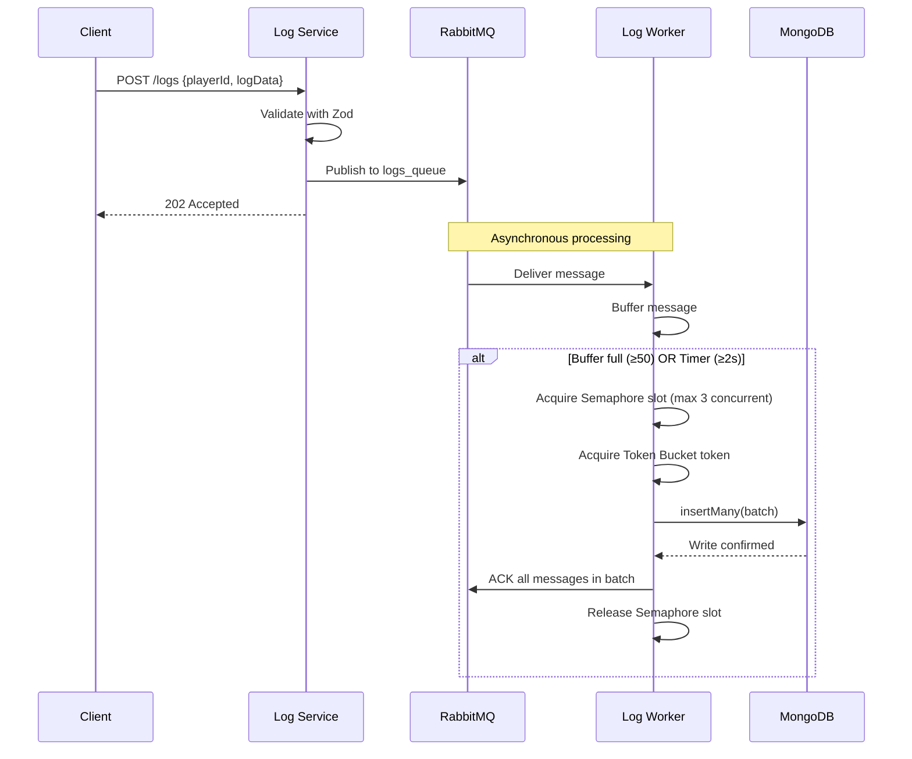
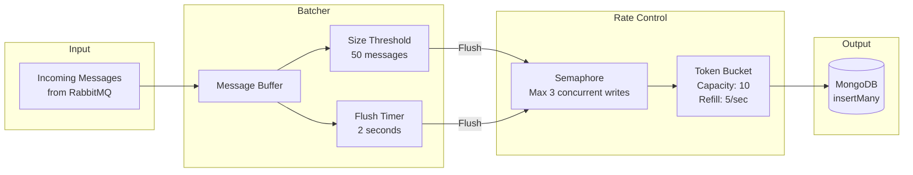
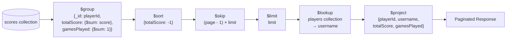
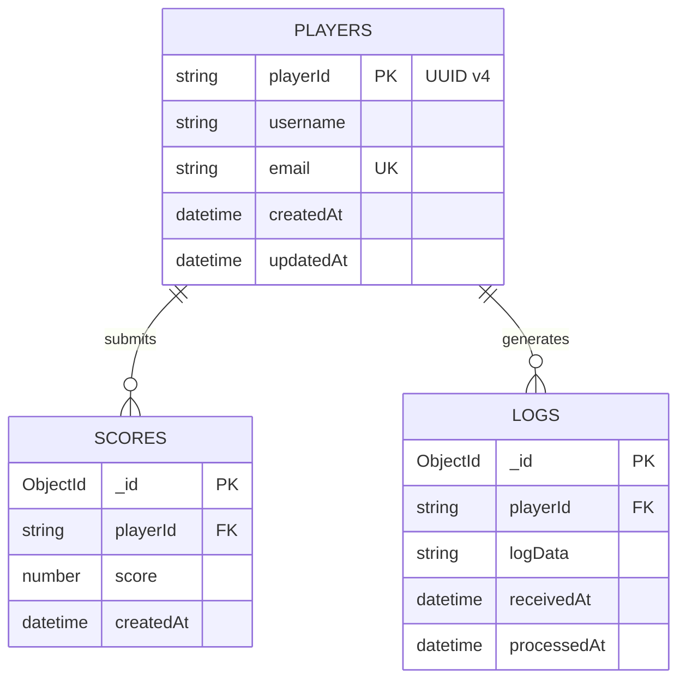
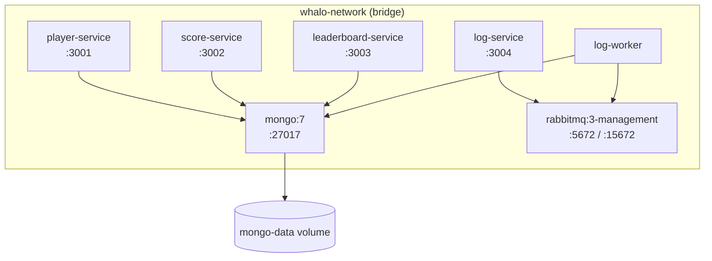

# Architecture

## System Overview

```mermaid
graph TB
    Client[Mobile Game Client]

    subgraph API["Microservices (Express.js / TypeScript)"]
        PS[Player Service<br/>:3001]
        SS[Score Service<br/>:3002]
        LS[Leaderboard Service<br/>:3003]
        LGS[Log Service<br/>:3004]
    end

    subgraph Queue["Message Broker"]
        RMQ[RabbitMQ<br/>:5672]
    end

    subgraph Workers["Background Workers"]
        LW[Log Worker]
    end

    subgraph Storage["Data Layer"]
        MongoDB[(MongoDB<br/>:27017)]
    end

    Client -->|CRUD /players| PS
    Client -->|POST /scores<br/>GET /scores/top| SS
    Client -->|GET /players/leaderboard| LS
    Client -->|POST /logs| LGS

    PS -->|Read/Write players| MongoDB
    SS -->|Read/Write scores| MongoDB
    LS -->|Aggregate scores + lookup players| MongoDB
    LGS -->|Publish log message| RMQ
    RMQ -->|Consume messages| LW
    LW -->|Batch insertMany()| MongoDB
```

---

## Log Pipeline — Async Data Flow



---

## Log Worker Rate Control Strategies



---

## Leaderboard Aggregation Pipeline



---

## Database Schema



---

## Docker Compose Architecture


