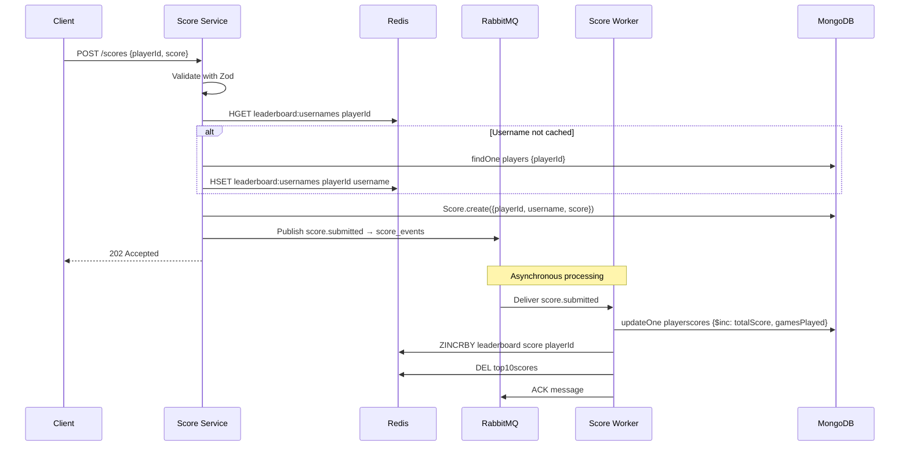
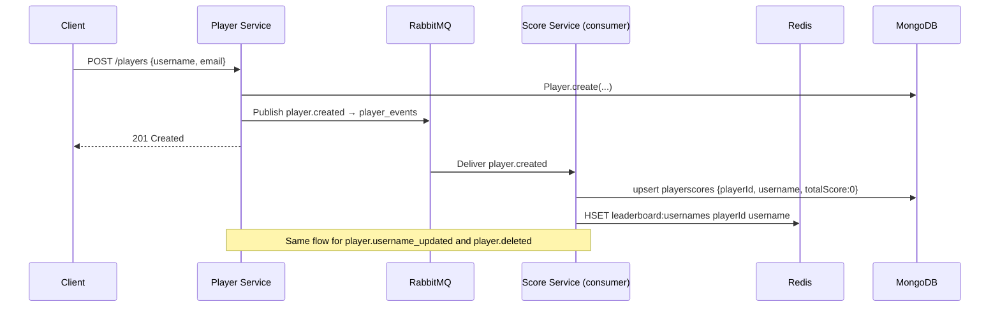
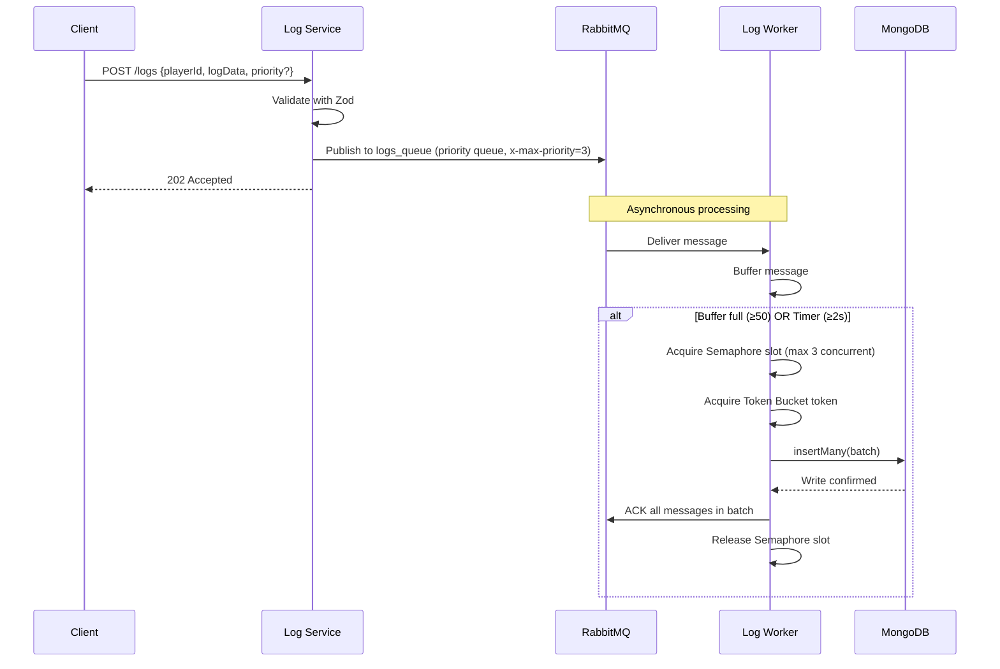
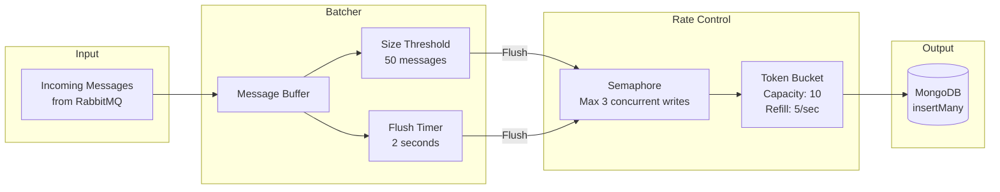
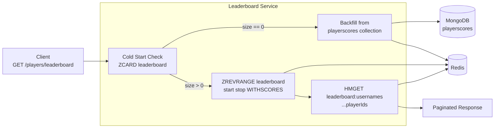
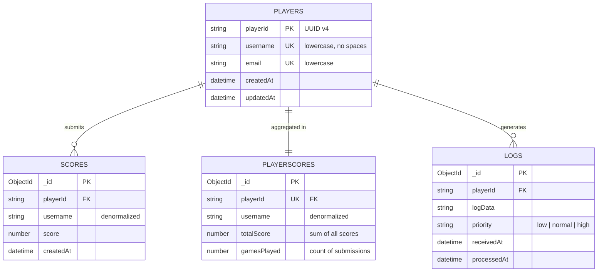
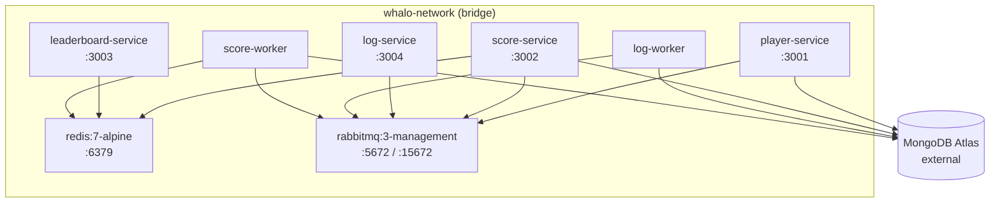

# Architecture

## System Overview

```mermaid
graph TB
    Client[Mobile Game Client]

    subgraph API["Microservices (Express.js / TypeScript)"]
        PS[Player Service<br/>:3001]
        SS[Score Service<br/>:3002]
        LS[Leaderboard Service<br/>:3003]
        LGS[Log Service<br/>:3004]
    end

    subgraph Queue["Message Broker"]
        RMQ[RabbitMQ<br/>:5672]
    end

    subgraph Workers["Background Workers"]
        LW[Log Worker]
        SW[Score Worker]
    end

    subgraph Storage["Data Layer"]
        MongoDB[(MongoDB Atlas)]
        Redis[(Redis<br/>:6379)]
    end

    Client -->|CRUD /players| PS
    Client -->|POST /scores<br/>GET /scores/top| SS
    Client -->|GET /players/leaderboard| LS
    Client -->|POST /logs| LGS

    PS -->|Read/Write players| MongoDB
    PS -->|Publish player_events| RMQ
    SS -->|Read/Write scores| MongoDB
    SS -->|Username lookup| Redis
    SS -->|Publish score_events| RMQ
    SS -->|Consume player_events| RMQ
    LS -->|ZREVRANGE leaderboard| Redis
    LGS -->|Publish logs_queue| RMQ

    RMQ -->|Consume logs_queue| LW
    RMQ -->|Consume score_events| SW
    LW -->|Batch insertMany()| MongoDB
    SW -->|Update playerscores| MongoDB
    SW -->|ZINCRBY leaderboard| Redis
```

---

## Score Pipeline — Async Data Flow



---

## Player Events — Async Data Flow



---

## Log Pipeline — Async Data Flow



---

## Log Worker Rate Control Strategies



---

## Leaderboard Read Path — Redis Sorted Set



---

## Database Schema



---

## Docker Compose Architecture


